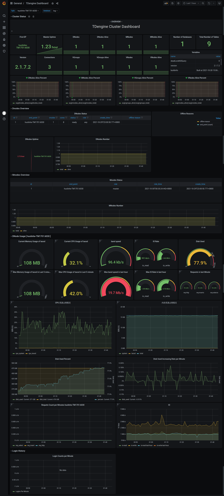

# [TDengine] [Grafana] Dashboard with Alert Support

- [Requirements](#requirements)
- [Install Grafana](#install-grafana)
  - [Install Grafana on Debian or Ubuntu](#install-grafana-on-debian-or-ubuntu)
  - [Install Grafana on CentOS/RHEL](#install-grafana-on-centosrhel)
- [Install TDengine Data Source Plugin](#install-tdengine-data-source-plugin)
- [Configure Grafana](#configure-grafana)
- [Start Grafana Service](#start-grafana-service)
- [Login to Grafana](#login-to-grafana)
- [Add TDengine Data Source](#add-tdengine-data-source)
- [Import TDengine Dashboard](#import-tdengine-dashboard)
- [The Dashboard Details](#the-dashboard-details)
  - [Cluster Status](#cluster-status)
  - [DNodes Status](#dnodes-status)
  - [MNodes Overview](#mnodes-overview)
  - [DNode Usage for each `fqdn`](#dnode-usage-for-each-fqdn)
  - [Login History](#login-history)
- [An all-in-one docker example](#an-all-in-one-docker-example)

## Requirements

At least, you must have a single-node [TDengine] server or a [TDengine] cluster with multiple nodes, and a server host for [Grafana]. This dashboard requires new log database, including `cluster_info` `dnodes_info` `vgroups_info` tables and so on. The changes is now in branch `feature/TD-6452` via develop stage.

## Install Grafana

The feature-rich [Grafana] dashboard for [TDengine] (cluster or not) requires Grafana 7.x or 8.x, so we recommend to use the latest [Grafana] 7/8 version here. You can install [Grafana] in any [supported OS](https://grafana.com/docs/grafana/latest/installation/requirements/#supported-operating-systems), follow the [installation instructions](https://grafana.com/docs/grafana/latest/installation/).

### Install Grafana on Debian or Ubuntu

For Debian or Ubuntu os, the first option is to use grafana APT repository. Here is how-to install it from scratch:

```sh
sudo apt-get install -y apt-transport-https
sudo apt-get install -y software-properties-common wget
wget -q -O - https://packages.grafana.com/gpg.key |\
  sudo apt-key add -
echo "deb https://packages.grafana.com/oss/deb stable main" |\
  sudo tee -a /etc/apt/sources.list.d/grafana.list
sudo apt-get update
sudo apt-get install grafana
```

### Install Grafana on CentOS/RHEL

You can install it from the official YUM repository.

```sh
sudo tee /etc/yum.repos.d/grafana.repo << EOF
[grafana]
name=grafana
baseurl=https://packages.grafana.com/oss/rpm
repo_gpgcheck=1
enabled=1
gpgcheck=1
gpgkey=https://packages.grafana.com/gpg.key
sslverify=1
sslcacert=/etc/pki/tls/certs/ca-bundle.crt
EOF
sudo yum install grafana
```

Or install with RPM:

```sh
wget https://dl.grafana.com/oss/release/grafana-7.5.11-1.x86_64.rpm
sudo yum install grafana-7.5.11-1.x86_64.rpm
# it's ok to use in one line
sudo yum install \
  https://dl.grafana.com/oss/release/grafana-7.5.11-1.x86_64.rpm
```

## Install TDengine Data Source Plugin

Install the TDengine data-source plugin from GitHub.

```sh
git clone --depth 1 https://github.com/taosdata/grafanaplugin.git
mkdir -p /var/lib/grafana/plugins/tdengine
cp -rf dist/* /var/lib/grafana/plugins/tdengine
```

## Configure Grafana

Add following lines to `/etc/grafana/grafana.ini`.

```ini
[plugins]
allow_loading_unsigned_plugins = tdengine-datasource
```

## Start Grafana Service

```sh
systemctl enable grafana-server
systemctl start grafana-server
```

## Login to Grafana

Open the default grafana url: `http://localhost:3000` in your web browser.
The default username/password is bot `admin`.
Grafana would ask you to change the password after first login.

## Add TDengine Data Source

Point to **Configurations** -> **Data Sources** menu and then **Add data source** button.


Search and choose **TDengine**.


Configure TDengine data source.


Save and test it, it should say 'TDengine Data source is working'.


## Import TDengine Dashboard

Point to **+** / **Create** - **import** (or `/dashboard/import` url).


Click on **Upload .JSON file** menu, point to your
`dashboards/tdengine-dashboard.json` file in `grafanaplugin` directory(downloaded with git previously) and load it.


Change the options if you need, and **Import** it.


Or use the dashboard id `15167` via grafna.com.


Then it's all done.

The full page view for TDengine will like below.



## The Dashboard Details

### Cluster Status

Include cluster current infomation and status (left-to-right).

- **First EP**: First EP in current TDengine cluster.
- **Version**: Server version of MNode.
- **Master Uptime**: time that the current master mnode elected.
- **Expire Time** - Expire time for enterprise version.
- **Used Measuring Points Used** - Used measuring points for enterprise version.
- **Databases** - The total number of databases.
- **Variables**: generated by `show variables` command and displayed as Table view.
- **Version**: TDengine version.
- **DNodes/MNodes/VGroups/VNodes**: total number for each kind kind of resources.
- **DNodes/MNodes/VGroups/VNodes Alive**: alive number for each kind of resources.
- **DNodes/MNodes/VGroups/VNodes Alive Percent**: alive number / total number for each kind of resources, with alert rule enabled, by default it will be triggered when the resource is not 100% alive.
- **Connections**: number count from connections.
- **Number of Databases**: number count from `show databases` results.
- **Total Number of Tables**: sum of table count of all databases.

### DNodes Status

- **DNodes Status**: Simple table view for `show dnodes`.
- **Offline Reasons**: offline reasons pie chart if any dnode status is offline.
- **DNode Uptime**: DNode uptime for current `fqdn`.
- **DNodes Number**: dnodes number changes time-serie.

### MNodes Overview

1. `MNodes Status`: Simple table view for `show mnodes`.
2. `MNodes Number`: like `DNodes Number`, but for mnode.

### DNode Usage for each `fqdn`

DNode resources details for specific node with grafana query type variable `$fqdn` (from `select tbname from log.dn`).

Consist with:

- Current memory usage, cpu usage, band speed, io read and write rate, disk used, etc.
- Max resources usage in last hour or some time.
- CPU graph view.
- Memory usage.
- Disk used percent: graph view with alert rule.
- Disk used.
- Requests count per minute.
- IO rate (read/write), with comparison to that in last hour.

### Login History

Currently only report login count per minute.

## An all-in-one docker example

```sh
git clone --depth 1 https://github.com/taosdata/grafanaplugin.git
cd grafanaplugin
```

Modify as needed in the `docker-compose.yml` file:

```yaml
version: "3.7"

services:
  grafana:
    image: grafana/grafana:7.5.10
    volumes:
      - ./dist:/var/lib/grafana/plugins/tdengine
      - ./grafana/:/etc/grafana/
      - grafana-data:/var/lib/grafana
    ports:
      - 3000:3000

volumes:
  grafana-data:
```

Start Grafana with [docker-compose].

```sh
docker-compose up -d
```

Now you can continue to import TDengine dashboard from login step.

[Grafana]: https://grafana.com
[TDengine]: https://www.taosdata.com
[docker-compose]: https://docs.docker.com/compose/
