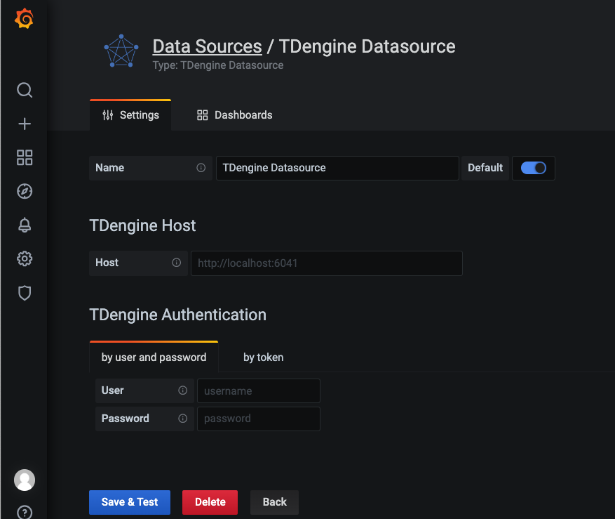

# TDinsight - A Zero-dependency Monitoring Solution For [TDengine] with [Grafana]

Languages: _English_ _[简体中文](https://www.taosdata.com/cn/documentation/tools/insight)_

TDinsight uses TDengine's built-in database(`log`) and [Grafana] to monitor TDengine itself.

After TDengine starts, it will automatically create a database named `log`, and regularly record the server's CPU, memory, disk usage, network bandwidth, number of requests, disk reading/writing throughput, slow queries, and other information for monitoring purposes. It also records important system operations(such as logging in, creating or deleting databases, etc.) and errors. TDinsight will visualize the TDengine cluster status, nodes information, insertion and query requests, resource usage, etc., with [Grafana] and [TDengine data source plugin for Grafana](https://github.com/taosdata/grafanaplugin/releases). It also supports abnormal status alarms of nodes including vnode, dnode, and mnode, which provides convenience for the operators to monitor the running status of TDengine clusters in real-time. In this document, we'll guide users to install the Grafana server, and then install the TDengine data source plugin and deploy the TDinsight visualization dashboard through the `TDinsight.sh` script automatically or manually.

## Requirements

At least, you must have a single-node [TDengine] server or a [TDengine] cluster with multiple nodes, and a server host for [Grafana]. This dashboard requires new log database(since v2.3.3.0), including `cluster_info` `dnodes_info` `vgroups_info` tables and so on.

## Install Grafana

The feature-rich [Grafana] dashboard for [TDengine] (cluster or not) requires Grafana 7.x or 8.x, so we recommend to use the latest [Grafana] 7/8 version here. You can install [Grafana] in any [supported OS](https://grafana.com/docs/grafana/latest/installation/requirements/#supported-operating-systems), follow the [installation instructions](https://grafana.com/docs/grafana/latest/installation/).

### Install Grafana on Debian or Ubuntu

For Debian or Ubuntu OS, the first option is to use grafana APT repository. Here is how-to install it from scratch:

```bash
sudo apt-get install -y apt-transport-https
sudo apt-get install -y software-properties-common wget
wget -q -O - https://packages.grafana.com/gpg.key |\
  sudo apt-key add -
echo "deb https://packages.grafana.com/oss/deb stable main" |\
  sudo tee -a /etc/apt/sources.list.d/grafana.list
sudo apt-get update
sudo apt-get install grafana
```

### Install Grafana on CentOS/RHEL

You can install it from the official YUM repository.

```bash
sudo tee /etc/yum.repos.d/grafana.repo << EOF
[grafana]
name=grafana
baseurl=https://packages.grafana.com/oss/rpm
repo_gpgcheck=1
enabled=1
gpgcheck=1
gpgkey=https://packages.grafana.com/gpg.key
sslverify=1
sslcacert=/etc/pki/tls/certs/ca-bundle.crt
EOF
sudo yum install grafana
```

Or install with RPM:

```bash
wget https://dl.grafana.com/oss/release/grafana-7.5.11-1.x86_64.rpm
sudo yum install grafana-7.5.11-1.x86_64.rpm
# it's ok to use in one line
sudo yum install \
  https://dl.grafana.com/oss/release/grafana-7.5.11-1.x86_64.rpm
```

## Setup TDinsight Automatically

We've created a [`TDinsight.sh`](https://github.com/taosdata/grafanaplugin/releases/latest/download/TDinsight.sh) script for automation with Grafana [provisioning](https://grafana.com/docs/grafana/latest/administration/provisioning/) strategy.

You can download the script by `wget` or other tools:

```bash
wget https://github.com/taosdata/grafanaplugin/releases/latest/download/TDinsight.sh
chmod +x TDinsight.sh
```

This script will automatically download the latest [TDengine data source plugin](https://github.com/taosdata/grafanaplugin/releases/latest) and [TDinsight dashboard](https://grafana.com/grafana/dashboards/15167), covert them to provisioning configurations and setup TDinsight dashboard. With some more alert options, you will get the alert notification feature within an one-line command.

For the most simple use case, suppose you're serving TDengine and Grafana on the same host with both default options. Running `./TDinsight.sh` and opening Grafana url are the only things you need to setup TDinsight.

Here is the usage of `TDinsight.sh`:

```bash
Usage:
   ./TDinsight.sh
   ./TDinsight.sh -h|--help
   ./TDinsight.sh -n <ds-name> -a <api-url> -u <user> -p <password>

Install and configure TDinsight dashboard in Grafana on Ubuntu 18.04/20.04 system.

-h, -help,          --help                  Display help

-V, -verbose,       --verbose               Run script in verbose mode. Will print out each step of execution.

-v, --plugin-version <version>              TDengine datasource plugin version, [default: latest]

-P, --grafana-provisioning-dir <dir>        Grafana provisioning directory, [default: /etc/grafana/provisioning/]
-G, --grafana-plugins-dir <dir>             Grafana plugins directory, [default: /var/lib/grafana/plugins]
-O, --grafana-org-id <number>               Grafana organization id. [default: 1]

-n, --tdengine-ds-name <string>             TDengine datasource name, no space. [default: TDengine]
-a, --tdengine-api <url>                    TDengine REST API endpoint. [default: http://127.0.0.1:6041]
-u, --tdengine-user <string>                TDengine user name. [default: root]
-p, --tdengine-password <string>            TDengine password. [default: taosdata]

-i, --tdinsight-uid <string>                Replace with a non-space ASCII code as the dashboard id. [default: tdinsight]
-t, --tdinsight-title <string>              Dashboard title. [default: TDinsight]
-e, --tdinsight-editable                    If the provisioning dashboard could be editable. [default: false]
```

Most of the CLI options are environment variable recognizable.

| short | long                       | env                          | description                                                            |
| ----- | -------------------------- | ---------------------------- | ---------------------------------------------------------------------- |
| -v    | --plugin-version           | TDENGINE_PLUGIN_VERSION      | TDengine datasource plugin version, default is latest.                 |
| -P    | --grafana-provisioning-dir | GF_PROVISIONING_DIR          | Grafana provisioning directory, [default: /etc/grafana/provisioning/]  |
| -G    | --grafana-plugins-dir      | GF_PLUGINS_DIR               | Grafana plugins directory, default is `/var/lib/grafana/plugins`.      |
| -O    | --grafana-org-id           | GF_ORG_ID                    | Grafana organization id, default is 1.                                 |
| -n    | --tdengine-ds-name         | TDENGINE_DS_NAME             | TDengine datasource name, default is TDengine.                         |
| -a    | --tdengine-api             | TDENGINE_API                 | TDengine REST API endpoint. default is `http://127.0.0.1:6041`.        |
| -u    | --tdengine-user            | TDENGINE_USER                | TDengine user name. [default: root]                                    |
| -p    | --tdengine-password        | TDENGINE_PASSWORD            | TDengine password. [default: taosdata]                                 |
| -i    | --tdinsight-uid            | TDINSIGHT_DASHBOARD_UID      | TDinsight dashboard `uid`. [default: tdinsight]                        |
| -t    | --tdinsight-title          | TDINSIGHT_DASHBOARD_TITLE    | TDinsight dashboard title. [default: TDinsight]                        |
| -e    | --tdinsight-editable       | TDINSIGHT_DASHBOARD_EDITABLE | If the provisioning dashboard could be editable. [default: false]      |

Suppose you are serving TDengine on host `tdengine`, with HTTP API port `6041`, user `root1`, password `pass5ord`. Use the script as:

```bash
./TDinsight.sh -a http://tdengine:6041 -u root1 -p pass5ord
```

We are providing a `-E` options to configure existing notification channel for TDinsight from command line. Suppose your Grafana user and password is `admin:admin`, use the following command to get the notification channels:

```bash
curl --no-progress-meter -u admin:admin http://localhost:3000/api/alert-notifications | jq
```

Here, we use `uid` property of the notification channel as `-E` input.

```bash
./TDinsight.sh -a http://tdengine:6041 -u root1 -p pass5ord -E existing-notifier
```

If you want to monitor multiple TDengine clusters, you need to setup multiple TDinsight dashboards. There's some required changes to setup non-default TDinsight - `-n` `-i` `-t` options are need to be changed to some other names.

```bash
sudo ./TDengine.sh -n TDengine-Env1 -a http://another:6041 -u root -p taosdata -i tdinsight-env1 -t 'TDinsight Env1'
```

Note that, the provisioning data sources, notification channels and dashboards are not changeable at frontend. You should update the configuration by this script again or change the provisioning configurations manually. The provisioning configurations are all located in `/etc/grafana/provisioning` directory (the directory is grafana default, change it with `-P` option as you need).

For special use cases, `-O` would set the organization id when you use Grafana Cloud or use a different organization. `-G` let you choose the grafana plugins install directory. `-e` would set the dashboard to be editable.

## Setup TDinsight Manually

### Install TDengine Data Source Plugin

Install the latest version of TDengine data-source plugin from GitHub.

```bash
get_latest_release() {
  curl --silent "https://api.github.com/repos/taosdata/grafanaplugin/releases/latest" |
    grep '"tag_name":' |
    sed -E 's/.*"v([^"]+)".*/\1/'
}
TDENGINE_PLUGIN_VERSION=$(get_latest_release)
sudo grafana-cli \
  --pluginUrl https://github.com/taosdata/grafanaplugin/releases/download/v$TDENGINE_PLUGIN_VERSION/tdengine-datasource-$TDENGINE_PLUGIN_VERSION.zip \
  plugins install tdengine-datasource
```

**NOTE**: If you're using an older version before v3.1.7, please configure to allow using unsigned plugins by add following lines to `/etc/grafana/grafana.ini`.

```ini
[plugins]
allow_loading_unsigned_plugins = tdengine-datasource
```

### Start Grafana Service

```bash
systemctl enable grafana-server
systemctl start grafana-server
```

### Login to Grafana

Open the default grafana url: `http://localhost:3000` in your web browser.
The default username/password is both `admin`.
Grafana would ask you to change the password after first login.

### Add TDengine Data Source

Point to **Configurations** -> **Data Sources** menu and then **Add data source** button.


Search and choose **TDengine**.


Configure TDengine data source.



Save and test it, it should say 'TDengine Data source is working'.


### Import TDengine Dashboard

Point to **+** / **Create** - **import** (or `/dashboard/import` url).


Use the dashboard id `15167` via grafana.com.


Then it's all done.

The full page view for TDengine will like below.


## TDinsight Dashboard Details

The TDinsight dashboard aims to provide TDengine cluster resources usage and status of [dnodes, mnodes, vnodes](https://www.taosdata.com/cn/documentation/architecture#cluster), or databases. There're several partitions of metrics.

### Cluster Status


Include cluster current information and status (left-right, top-down).

- **First EP**: First EP in current TDengine cluster.
- **Version**: Server version of MNode.
- **Master Uptime**: Time that the current master mnode elected.
- **Expire Time** - Expire time for enterprise version.
- **Used Measuring Points** - Used measuring points for enterprise version.
- **Databases** - The total number of databases.
- **Connections** - The connections number in current time.
- **DNodes/MNodes/VGroups/VNodes**: Total and alive number for each kind of resources.
- **DNodes/MNodes/VGroups/VNodes Alive Percent**: alive number / total number for each kind of resources, with alert rule enabled, by default it will be triggered when the resource is not 100% alive.
- **Measuring Points Used**: Used measuring points for enterprise version with alert enabled.
- **Grants Expire Time**: Expire time for enterprise version with alert enabled.
- **Error Rate**: The total error rate for the cluster with alert enabled.
- **Variables**: generated by `show variables` command and displayed as Table view.

### DNodes Status


- **DNodes Status**: Simple table view for `show dnodes`.
- **DNodes Lifetime**: The time elapsed from dnode created.
- **DNodes Number**: DNodes number changes time-series graph.
- **Offline Reasons**: Offline reasons pie chart if any dnode status is offline.

### MNodes Overview


1. **MNodes Status**: Simple table view for `show mnodes`.
2. **MNodes Number**: like `DNodes Number`, but for mnodes.

### Requests


1. **Requests Rate(Inserts per Second)**: Insert count per second rate.
2. **Requests (Selects)**: Select requests count and rate.
3. **Requests (HTTP)**: HTTP requests count and rate.

### Database for each `$database`


1. **STables**: Number of stables.
2. **Total Tables**: Number of all tables.
3. **Sub Tables**: Number of tables that is sub table of a stable.
4. **Tables**: Tables changes time-series data.
5. **Tables Number Foreach VGroups**: Tables number for each vgroups.

### DNode Usage for each `$fqdn`


DNode resources details for specific node with grafana query type variable `$fqdn` (from `select tbname from log.dn`), including:

- Current memory usage, cpu usage, band speed, io read and write rate, disk used, etc.
- Max resources usage in last hour or some time.
- CPU graph view.
- Memory usage.
- Disk used percent: graph view with alert rule.
- Disk used.
- Requests count per minute.
- IO rate (read/write), with comparison to that in last hour.

Here's the metrics list:

1. **Uptime**: Elapsed time from dnode created.
2. **Has MNodes?**: If the dnodes has mnode.
3. **CPU Cores**: Number of CPU cores.
4. **VNodes Number**: VNodes number of the current dnode.
5. **VNodes Masters**: The number of vnodes that are in master role.
6. **Current CPU Usage of taosd**: CPU usage of taosd process.
7. **Current Memory Usage of taosd**: Memory usage of taosd process.
8. **Disk Used**: Total disk usage percent of taosd data directory.
9. **CPU Usage**: Process and system CPU usage.
10. **RAM Usage**: RAM used metrics time-series view.
11. **Disk Used**: Disk used for each level.
12. **Disk Increasing Rate per Minute**: Disk increasing rate per minute.
13. **Disk IO**: Process read/write bytes time-series data and view.
14. **Net IO**: Total in/out bits for all networks except lo.

### Login History


Currently only report login count per minute.

### TaosAdapter


Includes taosAdapter http request statistics and status information

Here's the metrics list:

1. **http_request**: include total http requests, failed http requests and http requests in flight.
2. **top 3 request endpoint**: top 3 total requests number and the corresponding endpoint. 
3. **Memory Used**: taosAdapter memory usage
4. **latency_quantile(ms)**: Quantiles for each stages (1, 2, 5, 9, 99)
5. **top 3 failed request endpoint**: top 3 request failure number and the corresponding endpoint.
6. **CPU Used**: taosAdapter cpu usage

## Upgrade

Reinstall with `TDinsight.sh` will upgrade Grafana plugin and TDinsight dashboard.

In other cases, users should install the new TDengine data source plugin first, then remove and install the new TDinsight dashboard.

## Uninstall

With `TDinsight.sh`, just run `TDinsight.sh -R` to clean up all installed components.

Follow the next steps to clean up if you have installed TDinsight manually.

1. Remove TDinsight dashboard in Grafana webpage.
2. Remove TDengine from Grafana data sources.
3. Remove the `tdengine-datasource` plugin from Grafana plugins directory.

## An All-in-one Docker Example

```bash
git clone --depth 1 https://github.com/taosdata/grafanaplugin.git
cd grafanaplugin
```

Modify as needed in the `docker-compose.yml` file:

```yaml
version: "3.7"

services:
  grafana:
    image: grafana/grafana:7.5.10
    volumes:
      - ./dist:/var/lib/grafana/plugins/tdengine-datasource
      - ./grafana/grafana.ini:/etc/grafana/grafana.ini
      - ./grafana/provisioning/:/etc/grafana/provisioning/
      - grafana-data:/var/lib/grafana
    environment:
      TDENGINE_API: ${TDENGINE_API}
      TDENGINE_USER: ${TDENGINE_USER}
      TDENGINE_PASS: ${TDENGINE_PASS}
    ports:
      - 3000:3000

volumes:
  grafana-data:
```

Replace the environment variables in `docker-compose.yml` or set it `.env`, then start Grafana with [docker-compose].

```bash
docker-compose up -d
```

TDinsight is builtin, please go to http://localhost:3000/d/tdinsight/ to see the dashboard.

[Grafana]: https://grafana.com
[TDengine]: https://www.taosdata.com
[docker-compose]: https://docs.docker.com/compose/
