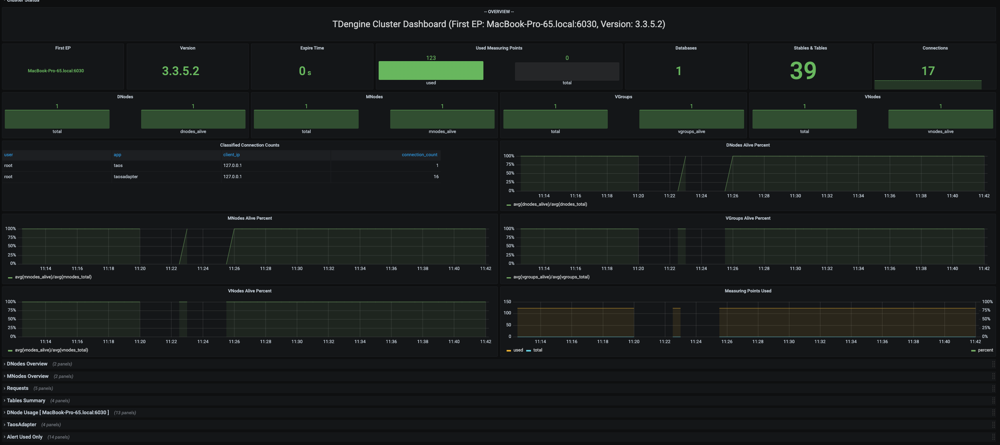
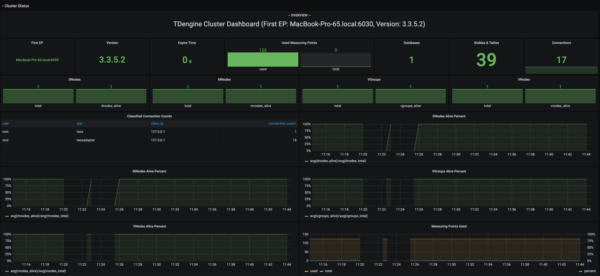

# TDinsight v3.x - 基于 Grafana 的 TDengine 监控解决方案

语言: _[English](https://www.taosdata.com/en/documentation/tools/insight)_ _简体中文_

TDinsight v3.x 是使用 [TDengine 3.0] 监控数据库和 [Grafana] 对 TDengine 进行监控的解决方案。

TDengine 通过 [taosKeeper](https://github.com/taosdata/taoskeeper) 将服务器的 CPU、内存、硬盘空间、带宽、请求数、磁盘读写速度、
慢查询等信息定时写入指定数据库，并对重要的系统操作（比如登录、创建、删除数据库等）以及各种错误报警信息进行记录。通过 [Grafana]
和
[TDengine 数据源插件](https://github.com/taosdata/grafanaplugin/releases)， TDinsight 将集群状态、节点信息、插入及查询请求、
资源使用情况等进行可视化展示，为开发者实时监控 TDengine 集群运行状态提供了便利。

本文将指导用户安装 Grafana 服务，安装 TDengine 数据源插件，以及部署 TDinsight v3.x 可视化面板。

## 系统要求

- 单节点的 TDengine 服务器或多节点的 [TDengine] 集群，以及一个 [Grafana] 服务器。 此仪表盘需要 TDengine 3.0.1.0
  及以上，并开启监控服务。具体配置请参考 [TDengine 监控配置](https://docs.taosdata.com/reference/config/#%E7%9B%91%E6%8E%A7%E7%9B%B8%E5%85%B3)
- taosAdapter 已安装并正常运行，具体细节请参考 [taosAdapter 使用手册](https://docs.taosdata.com/reference/taosadapter/)
- taosKeeper 已安装并正常运行，具体细节请参考 [taosKeeper 使用手册](https://docs.taosdata.com/reference/taosKeeper/)

## 安装 Grafana

我们建议在此处使用最新的[Grafana](https://grafana.com/) 8 或 9 版本。您可以在任何
[支持的操作系统](https://grafana.com/docs/grafana/latest/installation/requirements/#supported-operating-systems)中，按照
[Grafana 官方文档安装说明](https://grafana.com/docs/grafana/latest/installation/) 安装 [Grafana]。

### 在 Debian 或 Ubuntu 上安装 Grafana

对于 Debian 或 Ubuntu 操作系统，建议使用 Grafana 镜像仓库。使用如下命令从零开始安装：

```bash
sudo apt-get install -y apt-transport-https
sudo apt-get install -y software-properties-common wget
wget -q -O - https://packages.grafana.com/gpg.key |\
  sudo apt-key add -
echo "deb https://packages.grafana.com/oss/deb stable main" |\
  sudo tee -a /etc/apt/sources.list.d/grafana.list
sudo apt-get update
sudo apt-get install grafana
```

### 在 CentOS / RHEL 上安装 Grafana

您可以从官方 YUM 镜像仓库安装。

```bash
sudo tee /etc/yum.repos.d/grafana.repo << EOF
[grafana]
name=grafana
baseurl=https://packages.grafana.com/oss/rpm
repo_gpgcheck=1
enabled=1
gpgcheck=1
gpgkey=https://packages.grafana.com/gpg.key
sslverify=1
sslcacert=/etc/pki/tls/certs/ca-bundle.crt
EOF
sudo yum install grafana
```

或者用 RPM 安装：

```bash
wget https://dl.grafana.com/oss/release/grafana-7.5.11-1.x86_64.rpm
sudo yum install grafana-7.5.11-1.x86_64.rpm
# or
sudo yum install \
  https://dl.grafana.com/oss/release/grafana-7.5.11-1.x86_64.rpm
```

## 设置 TDinsight v3.x

### 安装 TDengine 数据源插件

#### 从 GitHub 安装 TDengine 最新版数据源插件

```bash
get_latest_release() {
  curl --silent "https://api.github.com/repos/taosdata/grafanaplugin/releases/latest" |
    grep '"tag_name":' |
    sed -E 's/.*"v([^"]+)".*/\1/'
}
TDENGINE_PLUGIN_VERSION=$(get_latest_release)
sudo grafana-cli \
  --pluginUrl https://github.com/taosdata/grafanaplugin/releases/download/v$TDENGINE_PLUGIN_VERSION/tdengine-datasource-$TDENGINE_PLUGIN_VERSION.zip \
  plugins install tdengine-datasource
```

**NOTE**: 插件版本 3.1.7 以下，需要在配置文件 `/etc/grafana/grafana.ini` 中添加如下设置，以启用未签名插件。

```ini
[plugins]
allow_loading_unsigned_plugins = tdengine-datasource
```

#### 从 Grafana Plugins 页面安装

点击 **Configurations** -> **Plugins**（或 "/plugins" url），搜索 "TDengine"。


点击 "TDengine Datasource" 插件，并点击 "install"。


### 启动 Grafana 服务

```bash
sudo systemctl start grafana-server
sudo systemctl enable grafana-server
```

### 登录到 Grafana

在 Web 浏览器中打开默认的 Grafana 网址：`http://localhost:3000`。
默认用户名/密码都是 `admin`。Grafana 会要求在首次登录后更改密码。

### 添加 TDengine 数据源

指向 **Configurations** -> **Data Sources** 菜单，然后点击 **Add data source** 按钮。


搜索并选择**TDengine**。


配置TDengine数据源。


保存并测试，正常情况下会报告 'TDengine Data source is working'。


### 导入仪表盘

#### 从数据源页面导入

在添加 TDengine 数据源页面点击 **Dashboard** tab


点击 TDinsight for 3.x 的 "import" 按钮，导入面板。

### 从导入面板页面导入

指向 **+** / **Create** - **import**（或 `/dashboard/import` url）。


在 **Import via grafana.com** 位置键入仪表盘 ID `18180` 并 **Load**。


导入完成后，TDinsight 的完整页面视图如下所示。



## TDinsight v3.x 仪表盘详细信息

TDinsight 仪表盘旨在提供TDengine
相关资源使用情况[dnodes, mnodes, vnodes](https://www.taosdata.com/cn/documentation/architecture#cluster)或数据库的使用情况和状态。

指标详情如下：

### 集群状态



这部分包括集群当前信息和状态（从左到右，从上到下）。

- **First EP**：当前TDengine集群中的`firstEp`设置。
- **Version**：TDengine 服务器版本（master mnode）。
- **Master Uptime**: 当前Master MNode 被选举为 Master 后经过的时间。
- **Expire Time** - 企业版过期时间。
- **Used Measuring Points** - 企业版已使用的测点数。
- **Databases** - 数据库个数。
- **Tables** - （子）表个数。
- **Connections** - 当前连接个数。
- **DNodes/MNodes/VGroups/VNodes**：每种资源的总数和存活数。
- **DNodes/MNodes/VGroups/VNodes Alive Percent**：每种资源的存活数/总数的比例。
- **Measuring Points Used**：测点数用量（社区版无数据，默认情况下是健康的）。
- **Grants Expire Time**：企业版过期时间（社区版无数据，默认情况是健康的）。
- **Error Rate**：集群错误率（每秒平均错误数）。

### DNodes 状态


- **DNodes Status**：`show dnodes` 的简单表格视图。
- **DNodes Lifetime**：从创建 dnode 开始经过的时间。
- **DNodes Number**：DNodes 数量变化。

### MNode 概述


1. **MNodes Status**：`show mnodes` 的简单表格视图。
2. **MNodes Number**：类似于`DNodes Number`，MNodes 数量变化。

### 请求数


1. **Requests Rate(Inserts per Second)**：平均每秒插入次数。
2. **Requests (Selects)**：查询请求数及变化率（count of second）。

### 数据库


数据库使用情况，对变量 `$database` 的每个值即每个数据库进行重复多行展示。

1. **STables**：超级表数量。
2. **Total Tables**：所有表数量。
3. **Tables**：所有普通表数量随时间变化图。
4. **Tables Number Foreach VGroups**：每个VGroups包含的表数量。

### DNode 资源使用情况


数据节点资源使用情况展示，对变量 `$fqdn` 即每个数据节点进行重复多行展示。包括：

1. **Uptime**：从创建 dnode 开始经过的时间。
2. **Has MNodes?**：当前 dnode 是否为 mnode。
3. **CPU Cores**：CPU 核数。
4. **VNodes Number**：当前dnode的VNodes数量。
5. **VNodes Masters**：处于master角色的vnode数量。
6. **Current CPU Usage of taosd**：taosd进程的CPU使用率。
7. **Current Memory Usage of taosd**：taosd进程的内存使用情况。
8. **Disk Used**：taosd数据目录的总磁盘使用百分比。
9. **CPU Usage**：进程和系统 CPU 使用率。
10. **RAM Usage**：RAM 使用指标时间序列视图。
11. **Disk Used**：多级存储下每个级别使用的磁盘（默认为 level0 级）。
12. **Disk IO**：磁盘IO速率。
13. **Net IO**：网络IO，除本机网络之外的总合网络IO速率。

### 登录历史


目前只报告每分钟登录次数。

### taosAdapter


包含 taosAdapter 请求统计和状态详情。包括：

1. **http_request**: 包含总请求数，请求失败数以及正在处理的请求数
2. **Http Request Fail**: 处理失败的请求数
3. **CPU Used**: taosAdapter cpu 使用情况
4. **Memory Used**: taosAdapter 内存使用情况
5. **Http Request Inflight**: 每个 endpoint http 请求统计
6. **Http Status Code**: Http 状态码统计

## 升级

可以通过重新安装 Grafana 插件和重新导入 TDinsight for 3.x 面板的方式升级 TDinsight。

## 卸载

要完全卸载TDinsight v3.x，需要清理以下内容：

1. 删除 Grafana 中的 TDinsight Dashboard v3.x。
2. 删除 Grafana 中的 Data Source 数据源。
3. 删除 Grafana 中的 `tdengine-datasource` 插件。

[Grafana]: https://grafana.com

[TDengine]: https://www.taosdata.com
