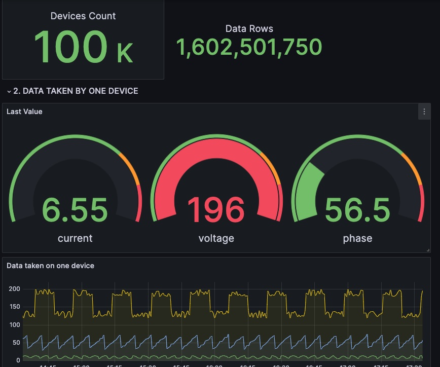

# TDsmeters - TDengine 数据集市智能电表演示

TDsmeters插件是一个实时显示插件，用于TDengine云服务数据集市中智能电表数据的动态收集过程。安装和使用非常简单，分为两个步骤：

一、建立数据源连接

1.打开本地安装的grafana页面，从主菜单中选择添加新连接。

2.在搜索框中输入TDengine Datasource，在下面会看到TDengine数据源连接插件。

3.点击插件，进入插件安装页面，点击安装，如果插件已经安装，则忽略此步骤。

4.返回主菜单，选择数据源，点击进入页面，点击页面右上角的添加新数据源按钮。

5.出现搜索框，输入TDengine Datasource，点击此选项

6.进入插件数据源配置页面，里面配置的内容需要登录获取数据源连接信息 https://cloud.tdengine.com/，在工具->grafana插件->添加数据源列中有详细说明

7.配置完成后，点击保存测试按钮，测试连接正确。

8.打开https://cloud.tdengine.com/，进入数据集市页面，打开“智能电表实时采集”共享库

二、安装TDsmeters插件

1.打开grafana主页，从主菜单中选择Dashborads。

2.进入Dashborads页面后，点击右上角的新建按钮，选择第三项导入。

3.进入导入页面，在带有Dashborad URL或ID的框中输入TDsmeters插件的ID，然后单击右侧的加载按钮进行加载。

4.进入插件配置页面后，输入您想要命名插件的名称。您不需要修改任何其他内容。只需在选择数据源中选择在上述步骤中建立的数据源。

5.填写完以上内容后，点击导入按钮即可完成导入。

6.此时插件页面就会显示在您面前。点击刷新周期可以定期刷新动态数据，从而看到实时更新。