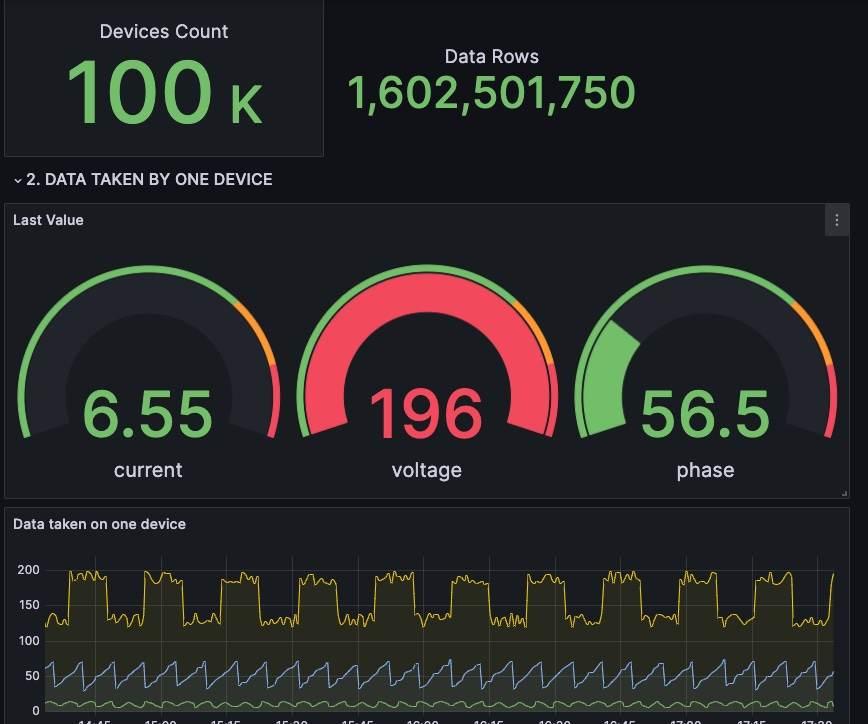

# TDsmeters - TDengine DBMark dmeters database show data

**Grafana version 10.0 or above is required**

The TDsmeters plugin is a real-time display plugin for the dynamic collection process of smart meter data in TDengine Cloud as a Service DBMark. Installation and use are very simple, divided into two steps:

I. Establish a data source connection

1. Open the locally installed grafana page and select add new connection from the main menu.
2. Enter TDengine Datasource in the search box, and the TDengine data source connection plugin will appear below
3. Click the plugin, go to the plugin installation page, click Install, ignore this step if the plugin is already installed
4. Return to the main menu and select Data sources, click to enter the page, and click the add new data source button in the upper right corner of the page.
5. Search box appears, enter TDengine Datasource, click this plugin
6. Enter the plugin data source configuration page, the content configured inside needs to login https://cloud.tdengine.com/ go here to get the data source connection information, specifically in the tools - > grafana plugin - > Add Data Source column has detailed instructions
7. After the configuration is completed, click the save & test button, and the test connection is correct.
8. Open https://cloud.tdengine.com/ , go to the DBMark page, and open “the real-time collection of smart meters” shared library

II. Install the TDsmeters plugin

1. Open the grafana main page and select Dashborads from the main menu.
2. After entering the Dashborads page, click the new button in the upper right corner and select the third item import.
3. Enter the import page, enter the ID of the TDsmeters plugin in the box with the Dashborad URL or ID, and click the load button on the right to load it.
4. After entering the plugin configuration page, enter the name you want to name the plugin. You don’t need to modify anything else. Just select the data source established in the above step in Select Data Source.
5. After filling in the above, click the import button to complete the import.
6. In this way, the plugin page is displayed in front of you. Click the refresh cycle to refresh regularly, and the dynamic data can be updated in real time.