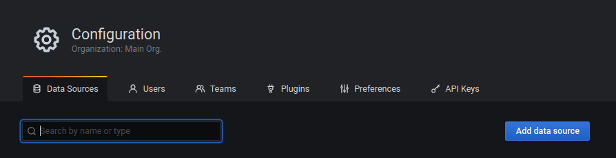
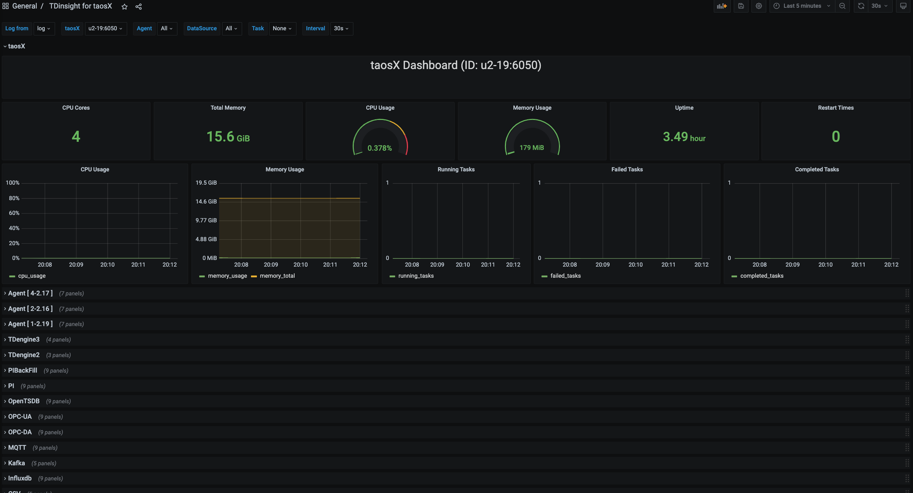

# TDinsight for taosX - 基于 Grafana 的 taosX 监控解决方案

taosX 是 TDengine 的数据接入，同步，备份和恢复的零代码平台，是 TDengine 企业版的重要功能。
TDinsight for taosX 是一个实时显示插件，用于监控 taosX 的各个组件如 Agent，Connector 和各数据源任务。安装和使用非常简单。

### 添加 TDengine 数据源

指向 **Configurations** -> **Data Sources** 菜单，然后点击 **Add data source** 按钮。

搜索并选择**TDengine**。

配置TDengine数据源。

保存并测试，正常情况下会报告 'TDengine Data source is working'。

### 导入仪表盘

#### 从数据源页面导入

在添加 TDengine 数据源页面点击 **Dashboard** tab

点击 `TDinsight for taosX` 的 "import" 按钮，导入面板。
导入完成后，`TDinsight for taosX` 的完整页面视图如下所示。

## TDinsight for taosX 仪表盘详细信息

### taosX

这部分包括当前选择 taosX 实例的基本信息（从左到右，从上到下）。

- **CPU Cores**：taosX 所在机器的 CPU 核数。
- **Total Memory**：taosX 所在机器的系统内存。
- **CPU Usage**：taosX 进程占用 CPU 百分比。
- **Memory Usage**：taosX 进程占用内存百分比。
- **Uptime**：taosX 运行时长。
- **Restart Times**：taosX 重启次数。
- **CPU Usage**：taosX 进程占用 CPU 百分比，时间序列形式。
- **Memory Usage**：taosX 进程占用内存百分比，时间序列形式。
- **Running Tasks**：taosX 当前执行任务数
- **Failed Tasks**：taosX 失败任务数
- **Completed Tasks**：taosX 完成任务数

### Agent

- **CPU Cores**：Agent 所在机器的 CPU 核数。
- **Total Memory**：Agent 所在机器的系统内存。
- **CPU Usage**：Agent 进程占用 CPU 百分比。
- **Memory Usage**：Agent 进程占用内存百分比。
- **CPU Usage**：Agent 进程占用 CPU 百分比，时间序列形式。
- **Memory Usage**：Agent 进程占用内存百分比，时间序列形式。

### TDengine3

-  **Task Info**：Task 信息，包括任务 id、名称、执行时间、写入行数、总执行时间和总写入行数。 
-  **Inserted Rows Rate**：插入行速率。
-  **Inserted Points Rate**：插入点速率。
-  **Write Raw Fails**：写入 raw meta 失败的次数。

### OPC-UA

- **Task Info**：Task 信息，包括 id，名称，执行时间，写入行数，总执行时间和总写入行数。 
- **Inserted Rows Rate**：插入行速率。
- **Inserted Points Rate**：插入点速率。
- **Processed/Received Batches**：已经处理的批数&通过 IPC Stream 收到的数据批数
- **Failed Sqls**：本次运行此任务执行失败的 INSERT SQL 总条数。
- **Connector CPU Percent**：Connector 进程占用 CPU 百分比，时间序列形式。
- **Connector Memory Percent**：Connector 进程占用内存百分比，时间序列形式。
- **Connector Disk Read Rate**：Connector 进程读取磁盘速度。
- **Connector Disk Write Rate**：Connector 进程写磁盘速度。

其他类型的数据源如 MQTT、CSV、Kafka 等的监控信息与 OPC-UA 类似，不再赘述。