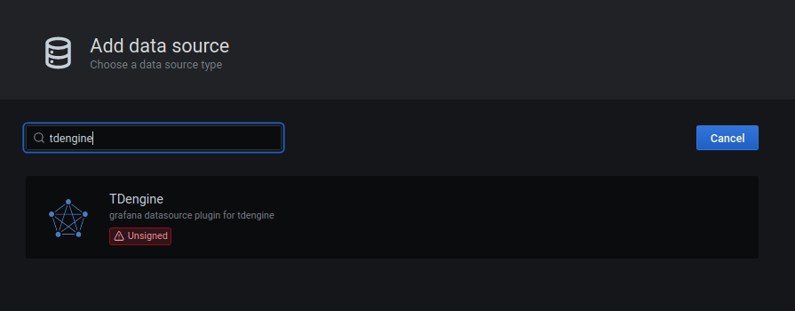
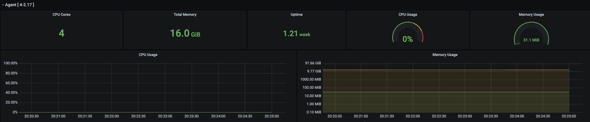
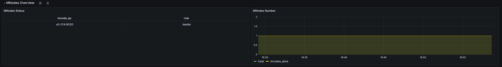

# TDinsight for taosX - A Monitoring Solution For [taosX] with [Grafana]

TaosX is a zero-code platform for data access, synchronization, backup, and recovery of TDengine, and is an important feature of TDengine Enterprise Edition. 
TDinsight for taosX is a real-time display plugin used to monitor various components of taosX such as Agent, Connector, and various data source tasks. It is very simple to install and use.

### Adding a TDengine Data Source

Point to the **Configurations** -> **Data Sources** menu, and click the **Add data source** button.

Search for and select **TDengine**.

Configure the TDengine datasource.

Save and test. It will report 'TDengine Data source is working' in normal circumstances.

### Importing dashboard

#### Importing dashboard from datasource confining page.

Click **Dashboard** tab in TDengine datasource confining page.

Click the "import" button of `TDinsight for taoX` to import the panel. 
After the import is complete, the full page view of `TDinsight for taoX` is as shown below.

## TDinsight for taosX Dashbord Detail

### taosX

This section includes the basic information of the currently selected taosX instance (from left to right, from top to bottom).

- **CPU Cores**: The number of CPU cores of the machine where taosX is located.
- **Total Memory**: The system memory of the machine where taosX is located.
- **CPU Usage**: The percentage of CPU usage by the taosX process.
- **Memory Usage**: The percentage of memory usage by the taosX process.
- **Uptime**: The running time of taosX.
- **Restart Times**: The number of times taosX has been restarted.
- **CPU Usage**: The percentage of CPU usage by the taosX process, in time series form.
- **Memory Usage**: The percentage of memory usage by the taosX process, in time series form.
- **Running Tasks**: The number of tasks currently being executed.
- **Failed Tasks**: The number of tasks failed.
- **Completed Tasks**: The number of tasks completed.

### Agent

- **CPU Cores**: The number of CPU cores of the machine where the Agent is located.
- **Total Memory**: The system memory of the machine where the Agent is located.
- **CPU Usage**: The percentage of CPU usage by the Agent process.
- **Memory Usage**: The percentage of memory usage by the Agent process.
- **CPU Usage**: The percentage of CPU usage by the Agent process, in time series form.
- **Memory Usage**: The percentage of memory usage by the Agent process, in time series form.

### TDengine3

-  **Task Info**: Task information, including task id, name, execution time, number of rows written, total execution time, and total number of rows written.
-  **Inserted Rows Rate**: Insertion rate of rows.
-  **Inserted Points Rate**: Insertion rate of points.
-  **Write Raw Fails**: The number of times the writing of raw meta failed.

### OPC-UA

- **Task Info**: Task information, including id, name, execution time, number of rows written, total execution time, and total number of rows written.
- **Inserted Rows Rate**: Insertion rate of rows.
- **Inserted Points Rate**: Insertion rate of points.
- **Processed/Received Batches**: The number of batches processed & the number of data batches received through IPC Stream.
- **Failed Sqls**: The total number of failed INSERT SQL statements during this task run.
- **Connector CPU Percent**: The percentage of CPU usage by the Connector process, in time series form.
- **Connector Memory Percent**: The percentage of memory usage by the Connector process, in time series form.
- **Connector Disk Read Rate**: The disk read speed of the Connector process.
- **Connector Disk Write Rate**: The disk write speed of the Connector process.

The monitoring information of other types of data sources such as MQTT, CSV, Kafka, etc., is similar to OPC-UA.