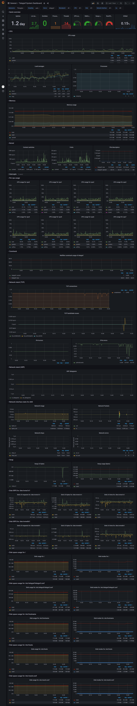

# Example Grafana Dashboards using TDengine

This an example project to show the how Telegraf + TDengine + Grafana works together.

The telegraf dashboard comes from the top 1 downloaded [dashboard](https://grafana.com/grafana/dashboards/928) - which downloaded 21k times - with InfluxDB data source, completely ported to TDengine with its [data source plugin](https://github.com/taosdata/grafanaplugin).



## Start

Suppose you have latest [TDengine](http://taosdata.com/) **2.3+** installed and both `taosd` and `blm3` service started.

You could check if port `6041` is ready to be connected with `telenet` or `curl` or so.

In `docker-compose.yml`, you should config the TDengine restful API as environment:

- `TDENGINE_API`: your TDengine RESTful API endpoint, like `http://tdengine:6041`
- `TDENGINE_USER`: TDengine user name, eg. `root`.
- `TDENGINE_PASS`: TDengine user password, eg. `taosdata`.

Then you could just start the example with `docker-compose`.

```bash
docker-compose up
```

## Services and Ports

### Grafana

- URL: http://localhost:3000
- User: admin
- Password: admin

### Telegraf

- Port: 8125 UDP (StatsD input)

### TDengine

- Port: 6041 (HTTP API)
- User: root
- Password: datadata
- Database: metrics

Open grafana with dashboard name **Telegraf System Dashboard** and everything done.

## License

The AGPL-3.0 License. Please see [License File](LICENSE) for more information.
