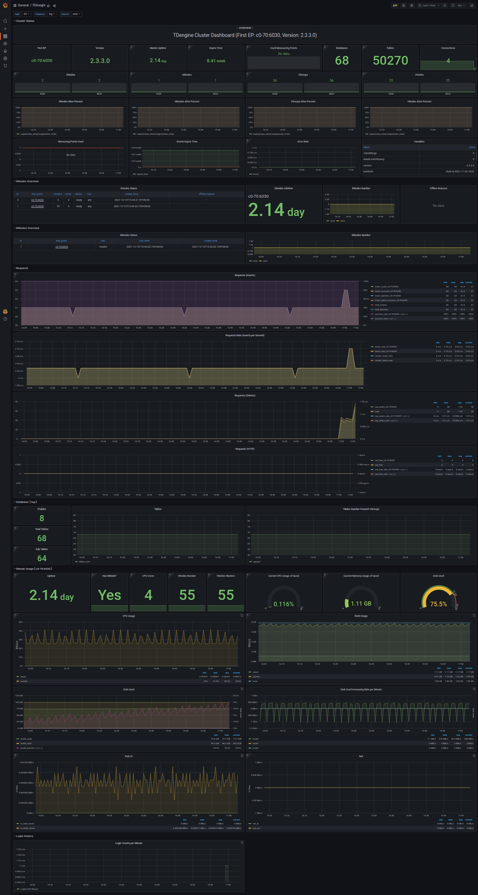
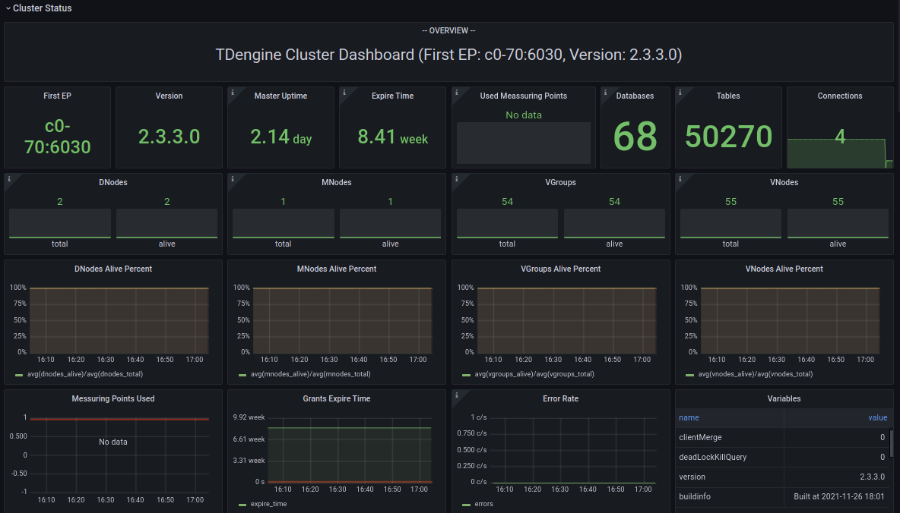
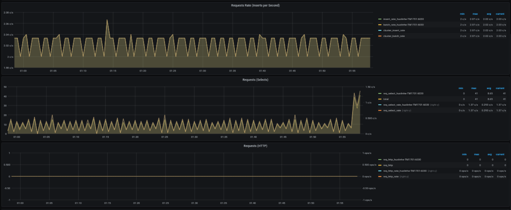

# TDinsight - 基于Grafana的TDengine零依赖监控解决方案

语言: _[English](https://www.taosdata.com/en/documentation/tools/insight)_ _简体中文_

TDinsight v2.x 是使用 [TDengine 2.x] 原生监控数据库和 [Grafana] 对 TDengine 进行监控的解决方案。

TDengine启动后，会自动创建一个监测数据库log，并自动将服务器的CPU、内存、硬盘空间、带宽、请求数、磁盘读写速度、慢查询等信息定时写入该数据库，并对重要的系统操作（比如登录、创建、删除数据库等）以及各种错误报警信息进行记录。通过 [Grafana] 和 [TDengine 数据源插件](https://github.com/taosdata/grafanaplugin/releases)，TDinsight 将集群状态、节点信息、插入及查询请求、资源使用情况等进行可视化展示，同时还支持vnode、dnode、mnode 节点状态异常告警，为开发者实时监控TDengine集群运行状态提供了便利。本文将指导用户安装 Grafana 服务器并通过 `TDinsight.sh` 安装脚本自动安装 TDengine 数据源插件及部署 TDinsight 可视化面板。

## 系统要求

要部署TDinsight，需要一个单节点的TDengine服务器或一个多节点的 [TDengine] 集群，以及一个[Grafana]服务器。此仪表盘需要 TDengine 2.3.3.0 及以上，并启用 `log` 数据库（`monitor = 1`）。

## 安装 Grafana

我们建议在此处使用最新的[Grafana] 7 或 8 版本。您可以在任何[支持的操作系统](https://grafana.com/docs/grafana/latest/installation/requirements/#supported-operating-systems)中，按照 [Grafana 官方文档安装说明](https://grafana.com/docs/grafana/latest/installation/) 安装 [Grafana]。

### 在 Debian 或 Ubuntu 上安装 Grafana

对于 Debian 或 Ubuntu 操作系统，建议使用 Grafana 镜像仓库。使用如下命令从零开始安装：

```bash
sudo apt-get install -y apt-transport-https
sudo apt-get install -y software-properties-common wget
wget -q -O - https://packages.grafana.com/gpg.key |\
  sudo apt-key add -
echo "deb https://packages.grafana.com/oss/deb stable main" |\
  sudo tee -a /etc/apt/sources.list.d/grafana.list
sudo apt-get update
sudo apt-get install grafana
```

### 在 CentOS / RHEL 上安装 Grafana

您可以从官方 YUM 镜像仓库安装。

```bash
sudo tee /etc/yum.repos.d/grafana.repo << EOF
[grafana]
name=grafana
baseurl=https://packages.grafana.com/oss/rpm
repo_gpgcheck=1
enabled=1
gpgcheck=1
gpgkey=https://packages.grafana.com/gpg.key
sslverify=1
sslcacert=/etc/pki/tls/certs/ca-bundle.crt
EOF
sudo yum install grafana
```

或者用 RPM 安装：

```bash
wget https://dl.grafana.com/oss/release/grafana-7.5.11-1.x86_64.rpm
sudo yum install grafana-7.5.11-1.x86_64.rpm
# or
sudo yum install \
  https://dl.grafana.com/oss/release/grafana-7.5.11-1.x86_64.rpm
```

## 自动部署 TDinsight v2.x

我们提供了一个自动化安装脚本 [`TDinsight.sh`](https://github.com/taosdata/grafanaplugin/releases/latest/download/TDinsight.sh) 脚本以便用户快速进行安装配置。

您可以通过 `wget` 或其他工具下载该脚本：

```bash
wget https://github.com/taosdata/grafanaplugin/releases/latest/download/TDinsight.sh
chmod +x TDinsight.sh
```

这个脚本会自动下载最新的[Grafana TDengine 数据源插件](https://github.com/taosdata/grafanaplugin/releases/latest) 和 [TDinsight 仪表盘](https://grafana.com/grafana/dashboards/15167) ，将命令行选项中的可配置参数转为 [Grafana Provisioning](https://grafana.com/docs/grafana/latest/administration/provisioning/) 配置文件，以进行自动化部署及更新等操作。利用该脚本提供的告警设置选项，你还可以获得内置的阿里云短信告警通知支持。

假设您在同一台主机上使用 TDengine 和 Grafana 的默认服务。运行 `./TDinsight.sh` 并打开 Grafana 浏览器窗口就可以看到 TDinsight 仪表盘了。

下面是 TDinsight.sh 的用法说明：

```bash
Usage:
   ./TDinsight.sh
   ./TDinsight.sh -h|--help
   ./TDinsight.sh -n <ds-name> -a <api-url> -u <user> -p <password>

Install and configure TDinsight dashboard in Grafana on Ubuntu 18.04/20.04 system.

-h, -help,          --help                  Display help

-V, -verbose,       --verbose               Run script in verbose mode. Will print out each step of execution.

-v, --plugin-version <version>              TDengine datasource plugin version, [default: latest]

-P, --grafana-provisioning-dir <dir>        Grafana provisioning directory, [default: /etc/grafana/provisioning/]
-G, --grafana-plugins-dir <dir>             Grafana plugins directory, [default: /var/lib/grafana/plugins]
-O, --grafana-org-id <number>               Grafana organization id. [default: 1]

-n, --tdengine-ds-name <string>             TDengine datasource name, no space. [default: TDengine]
-a, --tdengine-api <url>                    TDengine REST API endpoint. [default: http://127.0.0.1:6041]
-u, --tdengine-user <string>                TDengine user name. [default: root]
-p, --tdengine-password <string>            TDengine password. [default: taosdata]

-i, --tdinsight-uid <string>                Replace with a non-space ASCII code as the dashboard id. [default: tdinsight]
-t, --tdinsight-title <string>              Dashboard title. [default: TDinsight]
-e, --tdinsight-editable                    If the provisioning dashboard could be editable. [default: false]
```

大多数命令行选项都可以通过环境变量获得同样的效果。

| 短选项 | 长选项                     | 环境变量                     | 说明                                                                        |
| ------ | -------------------------- | ---------------------------- | --------------------------------------------------------------------------- |
| -v     | --plugin-version           | TDENGINE_PLUGIN_VERSION      | TDengine 数据源插件版本，默认使用最新版。                                   |
| -P     | --grafana-provisioning-dir | GF_PROVISIONING_DIR          | Grafana 配置目录，默认为`/etc/grafana/provisioning/`                        |
| -G     | --grafana-plugins-dir      | GF_PLUGINS_DIR               | Grafana 插件目录，默认为`/var/lib/grafana/plugins`。                        |
| -O     | --grafana-org-id           | GF_ORG_ID                    | Grafana 组织 ID，默认为 1。                                                 |
| -n     | --tdengine-ds-name         | TDENGINE_DS_NAME             | TDengine 数据源名称，默认为TDengine。                                       |
| -a     | --tdengine-api             | TDENGINE_API                 | TDengine REST API 端点。默认为`http://127.0.0.1:6041`。                     |
| -u     | --tdengine-user            | TDENGINE_USER                | TDengine 用户名。 [默认值：root]                                            |
| -p     | --tdengine-密码            | TDENGINE_PASSWORD            | TDengine密码。 [默认：taosdata]                                             |
| -i     | --tdinsight-uid            | TDINSIGHT_DASHBOARD_UID      | TDinsight 仪表盘`uid`。 [默认值：tdinsight]                                 |
| -t     | --tdinsight-title          | TDINSIGHT_DASHBOARD_TITLE    | TDinsight 仪表盘标题。 [默认：TDinsight]                                    |
| -e     | --tdinsight-可编辑         | TDINSIGHT_DASHBOARD_EDITABLE | 如果配置仪表盘可以编辑。 [默认值：false]                                    |

假设您在主机 `tdengine` 上启动 TDengine 数据库，HTTP API 端口为 `6041`，用户为 `root1`，密码为 `pass5ord`。执行脚本：

```bash
./TDinsight.sh -a http://tdengine:6041 -u root1 -p pass5ord
```

我们提供了一个“-E”选项，用于从命令行配置 TDinsight 使用现有的通知通道(Notification Channel)。假设你的 Grafana 用户和密码是 `admin:admin`，使用以下命令获取已有的通知通道的`uid`：

```bash
curl --no-progress-meter -u admin:admin http://localhost:3000/api/alert-notifications | jq
```

使用上面获取的 `uid` 值作为 `-E` 输入。

```bash
./TDinsight.sh -a http://tdengine:6041 -u root1 -p pass5ord -E existing-notifier
```

如果要监控多个 TDengine 集群，则需要设置多个 TDinsight 仪表盘。设置非默认 TDinsight 需要进行一些更改： `-n` `-i` `-t` 选项需要更改为非默认名称。

```bash
sudo ./TDengine.sh -n TDengine-Env1 -a http://another:6041 -u root -p taosdata -i tdinsight-env1 -t 'TDinsight Env1'
```

请注意，配置数据源、通知Channel和仪表盘在前端是不可更改的。您应该再次通过此脚本更新配置或手动更改 `/etc/grafana/provisioning` 目录（这是Grafana的默认目录，根据需要使用`-P`选项更改）中的配置文件。

特别地，当您使用 Grafana Cloud 或其他组织时，`-O` 可用于设置组织 ID。 `-G` 可指定 Grafana 插件安装目录。 `-e` 参数将仪表盘设置为可编辑。

## 手动设置 TDinsight

### 安装TDengine数据源插件

从 GitHub 安装 TDengine 最新版数据源插件。

```bash
get_latest_release() {
  curl --silent "https://api.github.com/repos/taosdata/grafanaplugin/releases/latest" |
    grep '"tag_name":' |
    sed -E 's/.*"v([^"]+)".*/\1/'
}
TDENGINE_PLUGIN_VERSION=$(get_latest_release)
sudo grafana-cli \
  --pluginUrl https://github.com/taosdata/grafanaplugin/releases/download/v$TDENGINE_PLUGIN_VERSION/tdengine-datasource-$TDENGINE_PLUGIN_VERSION.zip \
  plugins install tdengine-datasource
```

**NOTE**: 插件版本 3.1.7 以下，需要在配置文件 `/etc/grafana/grafana.ini` 中添加如下设置，以启用未签名插件。

```ini
[plugins]
allow_loading_unsigned_plugins = tdengine-datasource
```

### 启动 Grafana 服务

```bash
sudo systemctl start grafana-server
sudo systemctl enable grafana-server
```

### 登录到 Grafana

在 Web 浏览器中打开默认的 Grafana 网址：`http://localhost:3000`。
默认用户名/密码都是 `admin`。Grafana 会要求在首次登录后更改密码。

### 添加TDengine数据源

指向 **Configurations** -> **Data Sources** 菜单，然后点击 **Add data source** 按钮。


搜索并选择**TDengine**。


配置TDengine数据源。


保存并测试，正常情况下会报告 'TDengine Data source is working'。


### 导入仪表盘

指向 **+** / **Create** - **import**（或 `/dashboard/import` url）。


在 **Import via grafana.com** 位置键入仪表盘 ID `15167` 并 **Load**。


导入完成后，TDinsight 的完整页面视图如下所示。



## TDinsight v2.x 仪表盘详细信息

TDinsight 仪表盘旨在提供TDengine 相关资源使用情况[dnodes, mnodes, vnodes](https://www.taosdata.com/cn/documentation/architecture#cluster)或数据库的使用情况和状态。

指标详情如下：

### 集群状态



这部分包括集群当前信息和状态，告警信息也在此处（从左到右，从上到下）。

- **First EP**：当前TDengine集群中的`firstEp`设置。
- **Version**：TDengine 服务器版本（master mnode）。
- **Master Uptime**: 当前Master MNode 被选举为 Master 后经过的时间。
- **Expire Time** - 企业版过期时间。
- **Used Measuring Points** - 企业版已使用的测点数。
- **Databases** - 数据库个数。
- **Connections** - 当前连接个数。
- **DNodes/MNodes/VGroups/VNodes**：每种资源的总数和存活数。
- **DNodes/MNodes/VGroups/VNodes Alive Percent**：每种资源的存活数/总数的比例，启用告警规则，并在资源存活率（1分钟内平均健康资源比例）不足100%时触发。
- **Measuring Points Used**：启用告警规则的测点数用量（社区版无数据，默认情况下是健康的）。
- **Grants Expire Time**：启用告警规则的企业版过期时间（社区版无数据，默认情况是健康的）。
- **Error Rate**：启用警报的集群总合错误率（每秒平均错误数）。
- **Variables**：`show variables` 表格展示。

### DNodes 状态


- **DNodes Status**：`show dnodes` 的简单表格视图。
- **DNodes Lifetime**：从创建 dnode 开始经过的时间。
- **DNodes Number**：DNodes 数量变化。
- **Offline Reason**：如果有任何 dnode 状态为离线，则以饼图形式展示离线原因。

### MNode 概述


1. **MNodes Status**：`show mnodes` 的简单表格视图。
2. **MNodes Number**：类似于`DNodes Number`，MNodes 数量变化。

### 请求



1. **Requests Rate(Inserts per Second)**：平均每秒插入次数。
2. **Requests (Selects)**：查询请求数及变化率（count of second）。
3. **Requests (HTTP)**：HTTP 请求数和请求速率（count of second）。

### 数据库


数据库使用情况，对变量 `$database` 的每个值即每个数据库进行重复多行展示。

1. **STables**：超级表数量。
2. **Total Tables**：所有表数量。
3. **Sub Tables**：所有超级表子表的数量。
4. **Tables**：所有普通表数量随时间变化图。
5. **Tables Number Foreach VGroups**：每个VGroups包含的表数量。

### DNode 资源使用情况


数据节点资源使用情况展示，对变量 `$fqdn` 即每个数据节点进行重复多行展示。包括：

1. **Uptime**：从创建 dnode 开始经过的时间。
2. **Has MNodes?**：当前 dnode 是否为 mnode。
3. **CPU Cores**：CPU 核数。
4. **VNodes Number**：当前dnode的VNodes数量。
5. **VNodes Masters**：处于master角色的vnode数量。
6. **Current CPU Usage of taosd**：taosd进程的CPU使用率。
7. **Current Memory Usage of taosd**：taosd进程的内存使用情况。
8. **Disk Used**：taosd数据目录的总磁盘使用百分比。
9. **CPU Usage**：进程和系统 CPU 使用率。
10. **RAM Usage**：RAM 使用指标时间序列视图。
11. **Disk Used**：多级存储下每个级别使用的磁盘（默认为 level0 级）。
12. **Disk Increasing Rate per Minute**：每分钟磁盘用量增加或减少的百分比。
13. **Disk IO**：磁盘IO速率。
14. **Net IO**：网络IO，除本机网络之外的总合网络IO速率。

### 登录历史


目前只报告每分钟登录次数。

### taosAdapter


包含 taosAdapter 请求统计和状态详情。包括：

1. **http_request**: 包含总请求数，请求失败数以及正在处理的请求数
2. **top 3 request endpoint**: 按终端分组，请求排名前三的数据
3. **Memory Used**: taosAdapter 内存使用情况
4. **latency_quantile(ms)**: (1, 2, 5, 9, 99)阶段的分位数
5. **top 3 failed request endpoint**: 按终端分组，请求失败排名前三的数据
6. **CPU Used**: taosAdapter cpu 使用情况

## 升级

通过 `TDinsight.sh` 脚本安装的 TDinsight，可以通过重新运行该脚本就可以升级到最新的Grafana插件和TDinsight Dashboard。

手动安装的情况下，可按照上述步骤自行安装新的Grafana插件和Dashboard。

## 卸载

通过 `TDinsight.sh` 脚本安装的 TDinsight，可以使用命令行 `TDinsight.sh -R` 清理相关资源。

手动安装时，要完全卸载TDinsight，需要清理以下内容：

1. Grafana 中的 TDinsight Dashboard。
2. Grafana 中的 Data Source 数据源。
3. 从插件安装目录删除 `tdengine-datasource` 插件。

## 整合的Docker示例

```bash
git clone --depth 1 https://github.com/taosdata/grafanaplugin.git
cd grafanaplugin
```

根据需要在 `docker-compose.yml` 文件中修改：

```yaml
version: "3.7"

services:
  grafana:
    image: grafana/grafana:7.5.10
    volumes:
      - ./dist:/var/lib/grafana/plugins/tdengine-datasource
      - ./grafana/grafana.ini:/etc/grafana/grafana.ini
      - ./grafana/provisioning/:/etc/grafana/provisioning/
      - grafana-data:/var/lib/grafana
    environment:
      TDENGINE_API: ${TDENGINE_API}
      TDENGINE_USER: ${TDENGINE_USER}
      TDENGINE_PASS: ${TDENGINE_PASS}
    ports:
      - 3000:3000
volumes:
  grafana-data:
```

替换`docker-compose.yml`中的环境变量或保存环境变量到`.env`文件，然后用`docker-compose up`启动Grafana。`docker-compose` 工具的具体用法参见 [Docker Compose Reference](https://docs.docker.com/compose/)

```bash
docker-compose up -d
```

TDinsight v2.x 已经通过 Provisioning 部署完毕，请到 http://localhost:3000/dashboards 查看仪表盘。

[Grafana]: https://grafana.com
[TDengine]: https://www.taosdata.com
