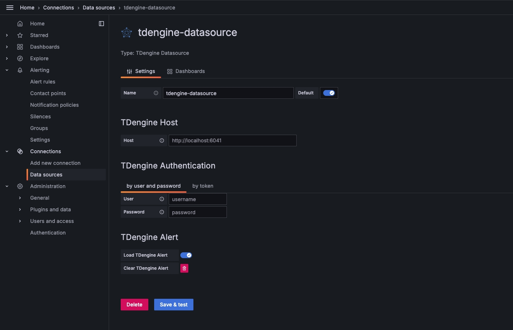
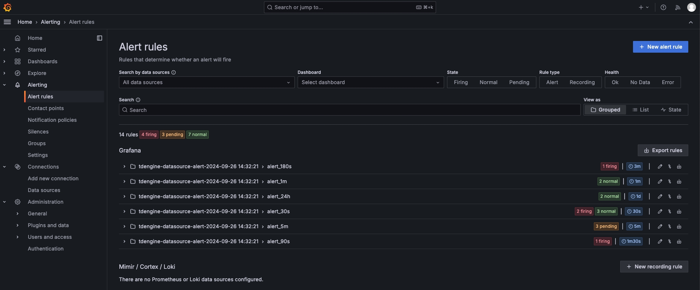
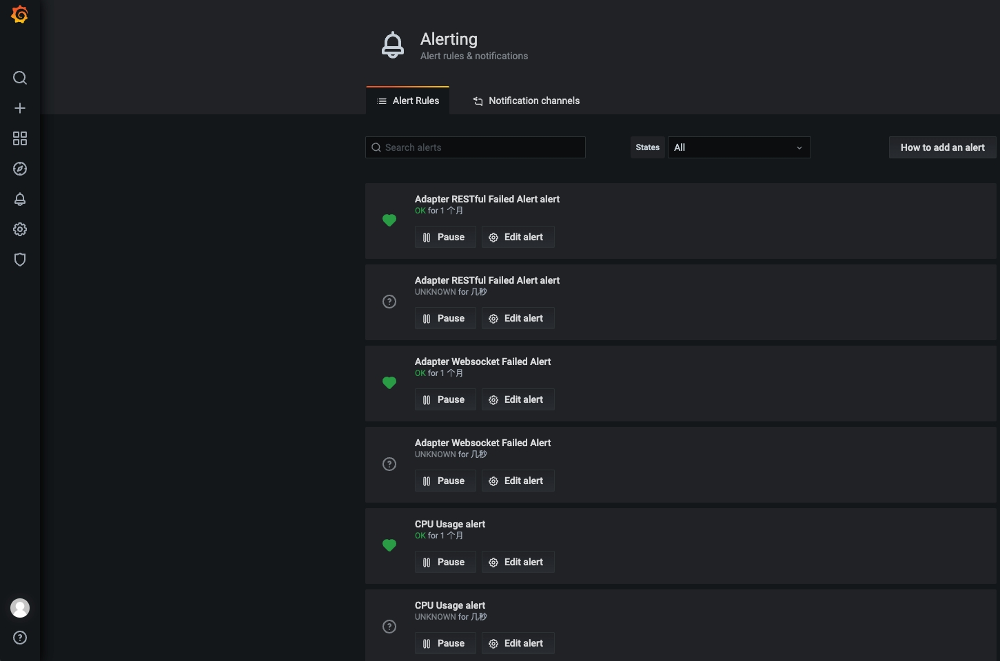

# TDinsight v3.x - 基于 Grafana 的 TDengine 监控解决方案

语言: _[English](https://www.taosdata.com/en/documentation/tools/insight)_ _简体中文_

TDinsight v3.x 是使用 [TDengine 3.x] 监控数据库和 [Grafana] 对 TDengine 进行监控的解决方案。

TDinsight v3.x 和 TDengine 的版本对应关系如下：
| TDinsight v3.x 版本 | TDengine 版本  |
| :-----------------: | :------------: |
|        3.7.0        | 3.3.0.0 及以上 |
|        3.6.3        | 3.3.0.0 及以上 |
|        3.6.2        | 3.3.0.0 及以上 |
|        3.6.1        | 3.3.0.0 及以上 |
|        3.6.0        | 3.3.0.0 及以上 |
|        3.5.2        | 3.3.0.0 及以上 |
|        3.5.1        | 3.3.0.0 及以上 |
|        3.5.0        | 3.2.3.0 及以上 |
|        3.4.0        | 3.2.0.1 及以上 |
|        3.2.7        | 3.0.0.0 及以上 |

TDengine 通过 [taosKeeper](https://github.com/taosdata/taoskeeper) 将服务器的 CPU、内存、硬盘空间、带宽、请求数、磁盘读写速度、
慢查询等信息定时写入指定数据库，并对重要的系统操作（比如登录、创建、删除数据库等）以及各种错误报警信息进行记录。通过 [Grafana]
和 [TDengine 数据源插件](https://github.com/taosdata/grafanaplugin/releases)， TDinsight 将集群状态、节点信息、插入及查询请求、资源使用情况等进行可视化展示，为开发者实时监控 TDengine 集群运行状态提供了便利。

本文将指导用户安装 Grafana 服务，安装 TDengine 数据源插件，以及部署 TDinsight v3.x 可视化面板。

> :exclamation: **注意：** 此面板暂不支持云服务。

## 系统要求

- 单节点的 TDengine 服务器或多节点的 [TDengine] 集群，以及一个 [Grafana] 服务器。 
  要求 TDengine 开启监控服务。具体配置请参考 [TDengine 监控配置](https://docs.taosdata.com/reference/config/#%E7%9B%91%E6%8E%A7%E7%9B%B8%E5%85%B3)
- taosAdapter 已安装并正常运行，具体细节请参考 [taosAdapter 使用手册](https://docs.taosdata.com/reference/taosadapter/)
- taosKeeper 已安装并正常运行，具体细节请参考 [taosKeeper 使用手册](https://docs.taosdata.com/reference/taosKeeper/)

## 安装 Grafana

我们建议在此处使用最新的[Grafana](https://grafana.com/) 版本，要求 Grafana 版本不低于 7.5。您可以在任何
[支持的操作系统](https://grafana.com/docs/grafana/latest/installation/requirements/#supported-operating-systems)中，按照
[Grafana 官方文档安装说明](https://grafana.com/docs/grafana/latest/installation/) 安装 [Grafana]。

### 在 Debian 或 Ubuntu 上安装 Grafana

对于 Debian 或 Ubuntu 操作系统，建议使用 Grafana 镜像仓库。使用如下命令从零开始安装：

```bash
sudo apt-get install -y apt-transport-https
sudo apt-get install -y software-properties-common wget
wget -q -O - https://packages.grafana.com/gpg.key |\
  sudo apt-key add -
echo "deb https://packages.grafana.com/oss/deb stable main" |\
  sudo tee -a /etc/apt/sources.list.d/grafana.list
sudo apt-get update
sudo apt-get install grafana
```

### 在 CentOS / RHEL 上安装 Grafana

您可以从官方 YUM 镜像仓库安装。

```bash
sudo tee /etc/yum.repos.d/grafana.repo << EOF
[grafana]
name=grafana
baseurl=https://packages.grafana.com/oss/rpm
repo_gpgcheck=1
enabled=1
gpgcheck=1
gpgkey=https://packages.grafana.com/gpg.key
sslverify=1
sslcacert=/etc/pki/tls/certs/ca-bundle.crt
EOF
sudo yum install grafana
```

或者用 RPM 安装：

```bash
wget https://dl.grafana.com/oss/release/grafana-7.5.11-1.x86_64.rpm
sudo yum install grafana-7.5.11-1.x86_64.rpm
# or
sudo yum install \
  https://dl.grafana.com/oss/release/grafana-7.5.11-1.x86_64.rpm
```

## 设置 TDinsight v3.x

### 安装 TDengine 数据源插件

#### 从 GitHub 安装 TDengine 最新版数据源插件

```bash
get_latest_release() {
  curl --silent "https://api.github.com/repos/taosdata/grafanaplugin/releases/latest" |
    grep '"tag_name":' |
    sed -E 's/.*"v([^"]+)".*/\1/'
}
TDENGINE_PLUGIN_VERSION=$(get_latest_release)
sudo grafana-cli \
  --pluginUrl https://github.com/taosdata/grafanaplugin/releases/download/v$TDENGINE_PLUGIN_VERSION/tdengine-datasource-$TDENGINE_PLUGIN_VERSION.zip \
  plugins install tdengine-datasource
```

**NOTE**: 插件版本 3.1.7 以下，需要在配置文件 `/etc/grafana/grafana.ini` 中添加如下设置，以启用未签名插件。

```ini
[plugins]
allow_loading_unsigned_plugins = tdengine-datasource
```

#### 从 Grafana Plugins 页面安装

点击 **Configurations** -> **Plugins**（或 "/plugins" url），搜索 "TDengine"。


点击 "TDengine Datasource" 插件，并点击 "install"。


### 启动 Grafana 服务

```bash
sudo systemctl start grafana-server
sudo systemctl enable grafana-server
```

### 登录到 Grafana

在 Web 浏览器中打开默认的 Grafana 网址：`http://localhost:3000`。
默认用户名/密码都是 `admin`。Grafana 会要求在首次登录后更改密码。

### 添加 TDengine 数据源

指向 **Configurations** -> **Data Sources** 菜单，然后点击 **Add data source** 按钮。


搜索并选择**TDengine**。


**为Grafana版本11配置TD引擎数据源。**

TDengine数据源插件为Grafana 11版本添加了功能，可以在添加数据源时自动导入TDengine集群基本指标（如CPU、内存、dnode、vnode等）的警报。

注意：
1. 关闭 `Load TDengine Alert` 按钮，在添加数据源时就不会自动导入告警规则。
2. 删除数据源时，需要先点击删除按钮，清除导入的告警规则。

**配置版本低于 11 的 Grafana 的 TDengine 数据源。**


保存并测试，正常情况下会报告 'TDengine Data source is working'。


### 导入仪表盘

#### 从数据源页面导入

在添加 TDengine 数据源页面点击 **Dashboard** tab


点击 TDinsight for 3.x 的 "import" 按钮，导入面板。

### 从导入面板页面导入

指向 **+** / **Create** - **import**（或 `/dashboard/import` url）。


在 **Import via grafana.com** 位置键入仪表盘 ID `18180` 并 **Load**。


导入完成后，TDinsight 的完整页面视图如下所示。


## TDinsight v3.x 仪表盘详细信息

TDinsight 仪表盘旨在提供TDengine
相关资源使用情况[dnodes, mnodes, vnodes](https://www.taosdata.com/cn/documentation/architecture#cluster)或数据库的使用情况和状态。

指标详情如下：

### 集群状态


这部分包括集群当前信息和状态（从左到右，从上到下）。

- **First EP**：当前TDengine集群中的`firstEp`设置。
- **Version**：TDengine 服务器版本（master mnode）。
- **Expire Time**：企业版过期时间。
- **Used Measuring Points**：企业版已使用的测点数。
- **Databases**：数据库个数。
- **STables & Tables**：超级表和表总数。
- **Connections**：当前连接个数。
- **DNodes/MNodes/VGroups/VNodes**：每种资源的总数和存活数。
- **DNodes/MNodes/VGroups/VNodes Alive Percent**：每种资源的存活数/总数的比例。
- **Measuring Points Used**：测点数用量（社区版无数据，默认情况下是健康的）。

### DNodes 状态


- **DNodes Status**：`show dnodes` 的简单表格视图。
- **DNodes Number**：DNodes 数量变化。

### MNode 概述


1. **MNodes Status**：`show mnodes` 的简单表格视图。
2. **MNodes Number**：类似于`DNodes Number`，MNodes 数量变化。

### 请求数


1. **Select Request**：select 请求数.
2. **Delete Request**：delete 请求数.
3. **Insert Request**：insert 请求数.
4. **Inserted Rows**：实际插入行数.
5. **Slow Sql**：慢查询数，可以在顶部分时长段过滤.

### 数据库


1. **STables**：超级表数量。
2. **Tables**：所有表数量。
3. **Tables**：所有普通表数量随时间变化图。
4. **Tables Number Foreach VGroups**：每个VGroups包含的表数量。

### DNode 资源使用情况


数据节点资源使用情况展示，对变量 `$fqdn` 即每个数据节点进行重复多行展示。包括：

1. **Uptime**：从创建 dnode 开始经过的时间。
2. **Has MNodes?**：当前 dnode 是否为 mnode。
3. **CPU Cores**：CPU 核数。
4. **VNodes Number**：当前dnode的VNodes数量。
5. **VNodes Masters**：处于master角色的vnode数量。
6. **Current CPU Usage of taosd**：taosd进程的CPU使用率。
7. **Current Memory Usage of taosd**：taosd进程的内存使用情况。
8. **Max Disk Used**：taosd 所有数据目录对应的最大磁盘使用率。
9. **CPU Usage**：进程和系统 CPU 使用率。
10. **RAM Usage**：RAM 使用指标时间序列视图。
11. **Disk Used**：多级存储下每个级别使用的磁盘（默认为 level0 级）。
12. **Disk IO**：磁盘IO速率。
13. **Net**：网络IO，除本机网络之外的总合网络IO速率。

### taosAdapter


包含 taosAdapter rest和websocket的请求统计详情。包括：

1. **Total**：总请求数
2. **Successful**：总成功数
3. **Failed**：总失败数
4. **Queries**：总查询数
5. **Writes**：总写入数
6. **Other**：总其他请求数

还有上述分类的细分维度折线图。

### TDengine 自动导入的告警规则
**11 版本自动导入**

数据源添加时选择加载告警规则后，点击告警菜单就能显示加载的告警规则，如下图：


**7.5 版本自动导入**

数据源添加完成后，点击告警菜单就能显示加载的告警规则，如下图：


**导入告警规则说明**

| 告警规则                   | 说明                                                                                                    |
| :------------------------- | :------------------------------------------------------------------------------------------------------ |
| dnode 节点的 CPU 负载      | 当集群中的某个节点在 5 分钟内 CPU 的负载始终高于 80%，会触发告警                                        |
| dnode 节点的的内存占用     | 当集群中的某个节点在 5 分钟内内存使用情况始终高于 60%，会触发告警                                       |
| dnode 节点的磁盘容量占用   | 当集群中的某个节点在 5 分钟内磁盘使用情况始终高于 60%，会触发告警                                       |
| 集群授权到期               | 当集群的授权时间小于 60 天后，会触发告警                                                                |
| 测点数达到授权测点数       | 当用户的测点数已大于总测点数的 90%，会触发告警                                                          |
| dnode 下线                 | 每 30 秒检查一次，当集群中有 dnode 节点下线， 会触发告警                                                |
| vnode 下线                 | 每 30 秒检查一次，当集群中有 vnode 节点下线， 会触发告警                                                |
| dnode 重启                 | 每 30 秒检查一次，当集群中有 dnode 节点被重启， 会触发告警                                              |
| dnode 节点状态             | 每 180 秒检查一次，当集群中有节点状态上报数量小于 3 次， 会触发告警                                     |
| 查询并发请求数             | 每 60 秒检查一次，当执行查询sql大于 100 次， 会触发告警                                                 |
| 数据删除请求数             | 每30检查一次，当有删除数据的 sql 提交到数据库执行时，会触发告警                                         |
| Adapter Restful 请求失败   | 每30检查一次，连接器通过 Restful 方式将数据库操作指令发给 Adapter 执行失败的次数大于 5 次，会触发告警   |
| Adapter Websocket 请求失败 | 每30检查一次，连接器通过 Websocket 方式将数据库操作指令发给 Adapter 执行失败的次数大于 5 次，会触发告警 |
| 慢查询                     | 每1分钟检查一次，当发现有查询耗时超过 300 秒，会触发告警                                                |

## 升级

可以通过重新安装 Grafana 插件和重新导入 TDinsight for 3.x 面板的方式升级 TDinsight。

## 卸载

要完全卸载TDinsight v3.x，需要清理以下内容：

1. 删除 Grafana 中的 TDinsight Dashboard v3.x。
2. 删除 Grafana 中的 Data Source 数据源。
3. 删除 Grafana 中的 `tdengine-datasource` 插件。

[Grafana]: https://grafana.com

[TDengine]: https://www.taosdata.com
